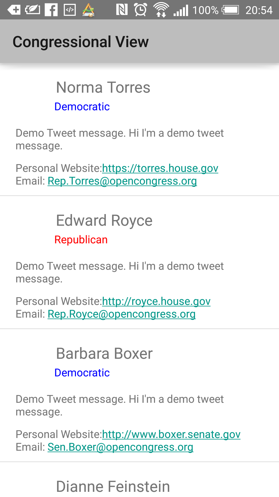
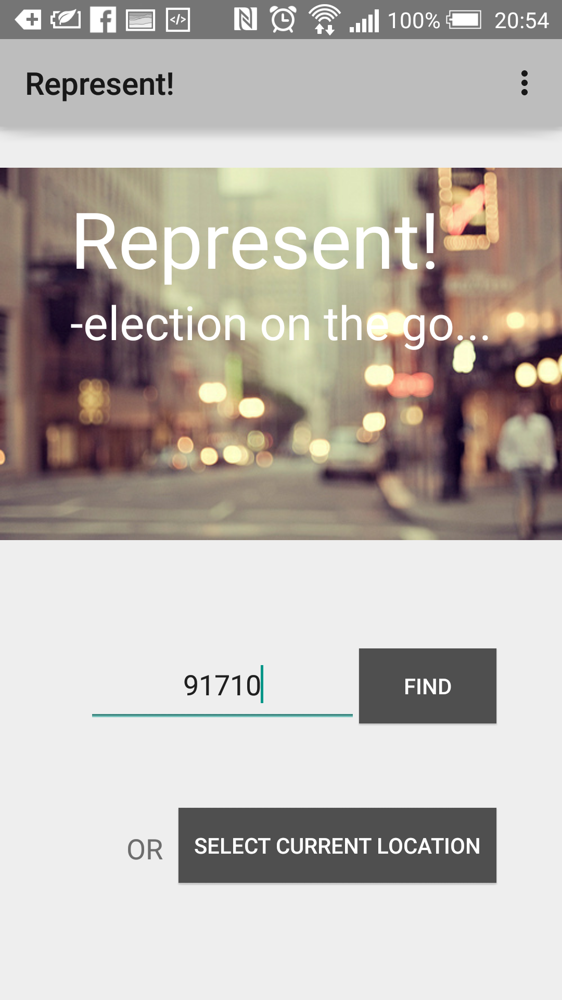
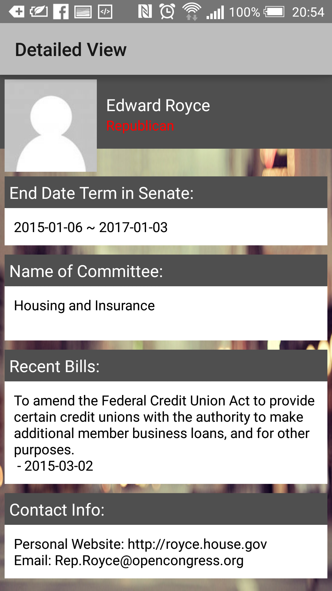

# PROG 02: Represent!

This is a phone and watch communicating app that generates inforamtion on the representatives in a specified area. It could be from your current location or a input zipCode. 

## Authors

Jennifer Hsu ([jwhsu@berkeley.edu](mailto:jwhsu@berkeley.edu))

## Demo Video

See [CS160 Project02 Phase C ] (https://www.youtube.com/watch?v=y76oJ2rYjhY&feature=youtu.be)

## Screenshots

